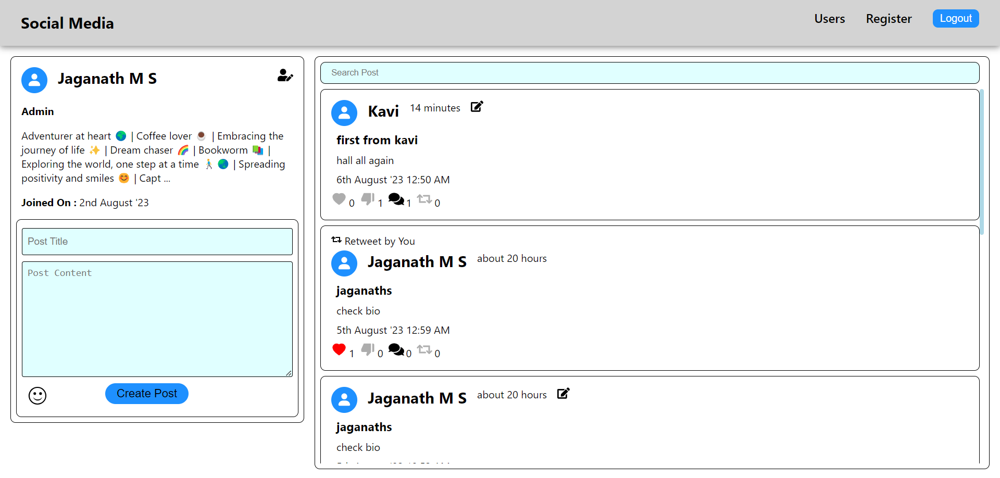

# Social Media
Welcome to my Social Media n project! This repository showcases my skills in implementing robust login and route authentication using JSON Web Tokens (JWT). The project not only ensures secure access but also includes features like creating/editing posts, modifying user details, and deactivating user accounts.

## Features:
- User Registration and Login: Register with an email and password, then securely log in.
- Token-based Authentication: Implement JWT-based authentication for route protection.
- User Profile Modification: Edit user details and enhance personalization.
- Post Management: Create, edit, and manage posts securely.

## Tech Stack:
- Frontend: React JS, HTML, CSS (Styled Component)
- Backend: Node.js, Express.js
- Database: MongoDB
- Authentication: JSON Web Tokens (JWT)

## Key Features:
- Robust authentication flow ensures secure user access.
- JWT guarantees data confidentiality and user privacy.
- CRUD operations for both user details and posts.
- Deactivation feature enhances user control.

## Get Started
1. Clone this repository: `git clone https://github.com/Jaganath-MSJ/Social-Media.git`
2. Navigate to the project directory: `cd Social-Media`
3. Navigate to Frontend: `cd client`
4. Install dependencies: `npm install`
5. Start frontend: `npm start`
4. Navigate to backend: `cd server`
5. Start the server: `node index.js`
6. Open the app in your browser: `http://localhost:3000`

## Demo:
For a live demonstration, you can visit [Demo Link](https://msj-social-media.netlify.app).

## Contact:
Feel free to reach out to me via email at [jagan.msjc@gmail.com](mailto:jagan.msjc@gmail.com) or connect on [LinkedIn](https://www.linkedin.com/in/jaganathms).

## Thanks To
[Netlify](https://www.netlify.com) for frondend

[Render](https://render.com) for backend